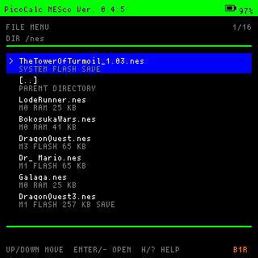
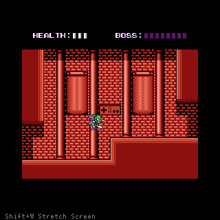
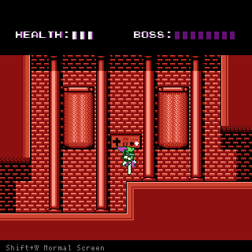

# Picocalc_NESco

`Picocalc_NESco` は、PicoCalc 向けに調整している NES エミュレーター firmware です。
現在の実装は `infones` ベースで、PicoCalc の LCD、I2C keyboard、PWM audio、SD / flash ROM 選択 menu に接続しています。

現在の埋め込み version は `1.0.4` です。
このプロジェクトは PicoCalc 専用 firmware を対象にしています。
PicoCalc 向け以外の build は未検証なので、現在は明示的に無効化しています。
`infones` 側にある他環境向け build は、このプロジェクトの対象外です。

## 概要

現状は「日常的に試せる build」ができていて、ROM menu、通常表示、stretch 表示、基本的なセーブデータ保存 / 復元まで動作確認が進んでいます。
一方で、特殊 mapper ROM の互換性確認など、継続して確認中の項目があります。



以下の画像は動作例です。ROM ファイルは同梱していません。
ゲーム中は通常表示と stretch 表示を切り替えできます。下のゲーム画面は Mapper30 ROM での動作例です。





## 実装の特徴

- `infones` ベースの NES emulation を PicoCalc 向け firmware として接続しています
- PicoCalc ROM menu から ROM を選択して起動できます
- SD card の ROM 読み込みと、本体 flash 常駐 ROM entry 表示に対応しています
- `ESC` による game から menu への復帰を確認しています
- `256x240` 通常表示に対応しています
- `320x300` stretch 表示に対応しています。ただし optional 表示機能であり、常時 `60fps` は保証していません
- game 中の `Shift+W` で `256x240` と `320x300` を切り替えできます
- battery-backed SRAM の `*.srm` save / restore に対応しています。`DragonQuest3` で実機確認済みです
- `Mapper30` ROM の起動と表示を実機確認済みです。ただし `*.m30` 保存 / 復元は未確認です
- `Map6` `Map19` `Map185` `Map188` `Map235` は dynamic 化済みです。ただし対象 mapper ROM での実機確認は未完です
- runtime log は default では banner 1 行目以外 disable です

## すぐ使うには

1. build して `Picocalc_NESco.uf2` を作る
2. SD card の `pico1-apps` に `Picocalc_NESco.uf2` を置く
3. 起動時に PicoCalc 側から選んで起動する
4. SD card に `.nes` を置く
5. 起動後の ROM menu から `Enter` または `-` で開始する

ROM ファイルは同梱していません。利用者自身が合法的に用意した ROM を使用してください。

PicoCalc への設置方法は、PicoCalc 側の `pico_multi_booter` など既存運用を参照してください。
事実として、`*.uf2` は SD card の `pico1-apps` に置くことで、起動時に選択できます。

## 操作方法

ROM menu:

- `Up / Down` : cursor move
- `Enter / -` : open or start
- `H / ?` : help
- `F5` : screenshot

In game:

- `Arrow keys` : D-pad
- `` ` `` : Select
- `-` : Start
- `[` : B
- `]` : A
- `ESC` : return to ROM menu
- `F1` : reset
- `F5` : screenshot
- `Shift+W` : `256x240` / `320x300` view toggle

## ビルド

事実:
- `PICO_SDK_PATH` が必須です
- build system は CMake + Pico SDK です
- target は `Picocalc_NESco` です
- `.uf2` は `pico_add_extra_outputs()` により生成されます

以下の build 例は `Picocalc_NESco/` で実行する前提です。

初回 build 例:

```bash
cmake -S . \
      -B build \
      -DPICO_SDK_PATH=/path/to/pico-sdk
cmake --build build -j4
```

既存 build dir を使う更新 build 例:

```bash
cd build
make clean
make -j4
```

build 後は、生成物から次を自動表示するようにしています。

- `arm-none-eabi-size`
- 埋め込み version / build id banner

想定生成物:

- `build/Picocalc_NESco.elf`
- `build/Picocalc_NESco.uf2`

GitHub Actions では、push / pull request / manual run 時に clean configure / build と `*.elf` / `*.uf2` 生成確認だけを自動実行します。実機確認は含みません。

実行時メモ:

- 起動時は version / build id banner を 1 行表示します
- それ以外の verbose runtime log は default では無効です
- game 開始時と通常表示復帰時には、viewport 外側へ `Shift+W Stretch Screen` のヒントを表示します
- 一番上の flash 常駐 entry は `SYSTEM FLASH` と表示します

## セーブ仕様

通常の battery-backed SRAM save は raw `*.srm` として扱います。

- `.nes` は SD card の `/nes` に置くことを推奨します
- root に置いても構いませんが、`/nes` がある場合はそこから起動する前提で運用しています
- `sd:/` から起動した ROM は、ROM と同じ場所に `*.srm` を置きます
- `flash:/` staged ROM は、flash metadata に保存した元の `sd:/.../*.nes` path を基準に、元 ROM と同じ場所へ `*.srm` を置きます
- metadata が古く元 path を持たない staged ROM だけは、fallback として `0:/saves/` を使います

`Mapper30` は、通常の `*.srm` に加えて PRG flash overlay を `*.m30` として保存 / 復元する初段実装があります。

事実:
- 通常の `*.srm` save は `DragonQuest3` で実機確認済みです
- `Mapper30` ROM の起動と表示は実機確認済みです
- `Mapper30` の `*.m30` 保存 / 復元は、実ゲームでの書き込み / 復元確認が未完です

## 既知の制約

- `Mapper30` の `*.m30` 保存 / 復元は実装済みですが、実ゲームでの書き込み / 復元確認は未完です
- `Map6` `Map19` `Map185` `Map188` `Map235` は dynamic 化済みですが、対象 mapper ROM での実機確認は未完です
- `core/` ディレクトリは repo に残っていますが、現在の active target source には入っていません
- 電源 ON 時の audio pop は残ることがありますが、現状は運用上許容として扱っています
- 互換性確認の最小セットは `docs/project/ARCHITECTURE.md` の `互換性確認の基準` を参照してください

## ライセンス概要

この repo は単一 license ではありません。概要は次です。

- project-owned top-level / `platform/` / `drivers/` : MIT
- `infones/` : GNU GPL v2
- `fatfs/` : FatFs license
- `font/` : M+ / PixelMplus derived data
- `core/` : source header 上は MIT だが、由来整理は継続中

`infones`、`fatfs`、font 系既存資産を除く PicoCalc 向け接続層・周辺実装の大半は Codex 支援のもとで作成しています。

正本は `LICENSE` を参照してください。

## 関連文書

- 現在のタスク: `docs/project/TASKS.md`
- 作業規約: `docs/project/CONVENTIONS.md`
- 構成メモ: `docs/project/ARCHITECTURE.md`
- 計画書索引: `docs/project/PLANS.md`
- agent 向け入口: `AGENTS.md`
- 履歴: `docs/project/Picocalc_NESco_HISTORY.md`
- `infones` 接続設計: `docs/design/INFONES_PLATFORM_CONNECTION_PLAN_20260419.md`
- mapper 動的化設計: `docs/design/MAPPER_DYNAMIC_ALLOCATION_PLAN_20260419.md`
